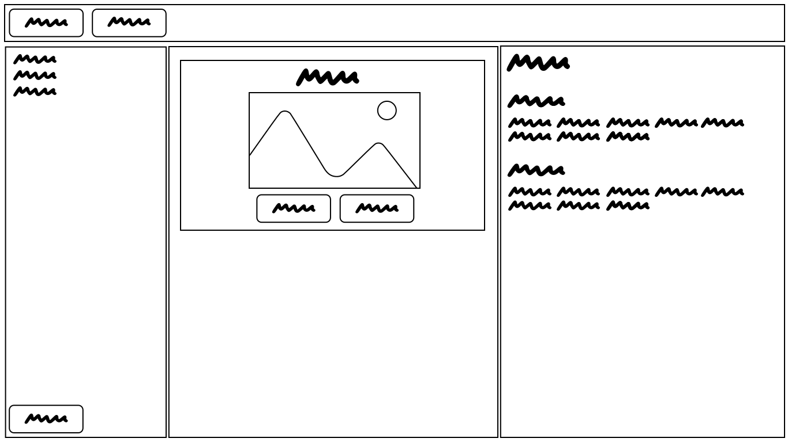

# phat-marker-sketcher

A web tool for actual design using fat marker sketches – nail the big picture first

> “Design is not just what it looks like and feels like. Design is how it works.” – Steve Jobs.

## Introduction

There is a technique in early software development stages where focus is on the big picture. What screens do we have? What kind of information is presented there? How do you navigate between these pages? Starting digging into more details that early will slow down the progress and may cause the team to get stuck in early ideas before the great ideas are reached.

Phat Marker Sketcher is a tool to encourage this way of working. The focus is on simple sketches, without graphical details and styles. The sketches comes with a text document describing the different elements of the design. A project in Phat Marker Sketcher is a collection of these one page sketches that can describe a full application or a new feature in an existing product.

The style should be like quickly hand drawn pictures with a fat tipped marker. More like the word squiggles in the picture above, and not like the super straight boxes.

### The parts

There are four main parts in the app:

1. The menu. For loading and saving projects initially. May contain settings, login, sharing etc.
2. A list of pages in the project. Each page has a name. There is an "Add page" button at the bottom
3. The drawing area. A screen (that you can draw outside) with the drawn elements. There is a visible grid that everything snaps to default. The drawing is completely monochrone, but controls have colors (like draggable corners, the menu)
4. Document pane. H1 is the project name. H2 are the page names. H3 are elements on the page. These headings are created when pages or elements are created. The project and page names are set by editing the headers in the document.

The space given to the three panes (pages, sketch, documentation) can be adjusted by dragging the separators between them.

### The graphical elements

All elements are defined by their top-left and bottom-right positions and a type, like button or text. The position can be changed by dragging entire elements, and size can be changed by draggin corners or sides.
The elements can links to pages. Editing the type of element is done by opening a modal using a menu button that is shown when an element is selected (or perhaps it's a floating mini menu like in Apple Freeform?).

## Roadmap

It would be neat with a figma style web application where multiple people can collaborate in real time and share documents as previews and so on. But to get somewhere we start with something that can be used by one user, and that does not require any backend.

The first step is a simple frontend only app, where you can load and save JSON-files with a project.

### Limitations, first version

- No "variants" of pages (used later to show same page on different devices, like desktop, landscape phone or tablet).
- No backend, files loaded and saved
- Few basic elements, perhaps only boxes and text
- Desktop only, fairly wide screens assumed
- No links to pages from elements

## Implementation

The app is written in javascript (and possibly soon typescript). It uses the React framework. The drawing feature is implemented using a Canvas.

The document editor should include the possibility to change to bold, italic and so on. It should support lists (and possibly tables). The first idea was to implement this using a react text editor (Draft.js? Quill? Slate?). But the current plan is to try out building this with a block editor instead (editor.js, SmartBlock? ).

editor.js
Has: JSON document, tables
editor.js example:
https://codesandbox.io/s/editorjs-react-editor-js-example-with-custom-react-block-template-up2zb?file=/src/index.js

The undo feature is central in these types of apps, so all interactions are modelled using the Command Pattern. The last couple of hundred actions are also saved in the JSON export.

## Future

### Element types

- Box
- Text button
- Empty Button
- Label
- Multi line text
- Image
- Icon
- Avatar
- Hamburger button
- Close button (X)
- Left button
- Right button
- Dropdown
- Line
- Checklist
- Input field

### Devices / Screens

- Desktop
  - Small
  - Medium
  - Large
- Phone
  - Portrait
  - Landscape
- Phablet
  - Portrait
  - Landscape
- Tablet
  - Portrait
  - Landscape

## Todo

- Sync element names (header) and element descriptions from editor into project

  - Take all blocks after the element's header until another non level 5 header and put them into the description

- Select / indicate the blocks of the selected element
- Indicate the element of the active block (go up in the blocks until an element header is found, stop at page headers)
- Make it possible to add new pages
- Add new actions (add-element) to project reducer (everything is using set-elements)
- Add list of element types below page list

  - Clicking one when an element is selected changes the type of that element
  - Clicking one when nothing is selected makes newly drawn elements that type

- Have a look on how often stuff is redrawn for no reason
- Expand mainState into dict
- Add lasso (when shiftKey is true for mousemove when otherwise draw would start)
- Add multiselect - drag and delete should work (not resize)
- Set minimum size for elements to 1, 1 - no more weird inverted lines
